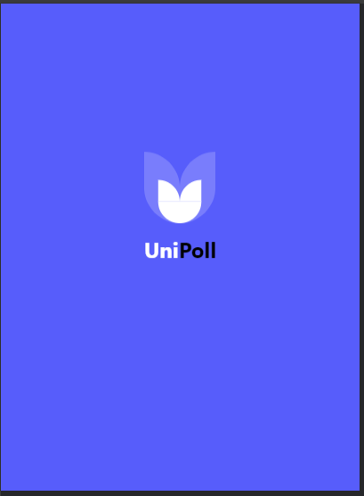
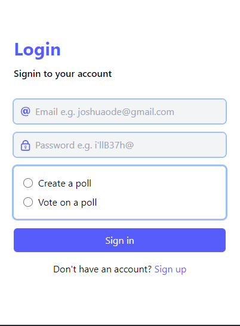
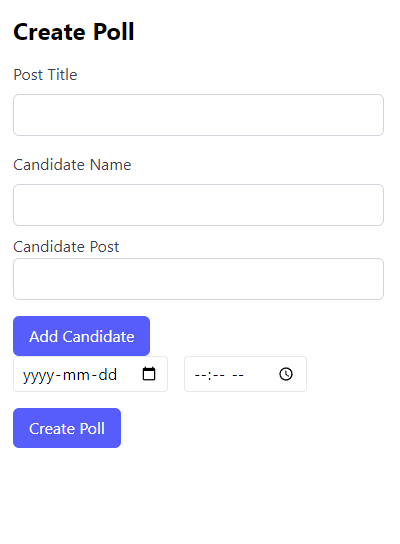

# UniPoll

Digital Voting Platform for Universties

## Installation

-   Clone the repo from `https://github.com/mighty-odewumi/buidlathon-vote.git`.
-   Change into the directory you cloned into with `cd buidlathon-vote`.
-   Run `npm install` to download the dependencies.
-   Run `npm run dev` to start up the server.

<!-- Improved compatibility of back to top link: See: https://github.com/othneildrew/Best-README-Template/pull/73 -->

<a name="readme-top"></a>

<!--
*** Thanks for checking out the Best-README-Template. If you have a suggestion
*** that would make this better, please fork the repo and create a pull request
*** or simply open an issue with the tag "enhancement".
*** Don't forget to give the project a star!
*** Thanks again! Now go create something AMAZING! :D
-->

<!-- PROJECT SHIELDS -->
<!--
*** I'm using markdown "reference style" links for readability.
*** Reference links are enclosed in brackets [ ] instead of parentheses ( ).
*** See the bottom of this document for the declaration of the reference variables
*** for contributors-url, forks-url, etc. This is an optional, concise syntax you may use.
*** https://www.markdownguide.org/basic-syntax/#reference-style-links
-->

<!-- PROJECT LOGO -->
<br />
<div align="center">
  <a href="https://github.com/othneildrew/Best-README-Template">
    
  </a>

  <h3 align="center">UniPoll</h3>

  <p align="center">
    Digital Voting platform
    <br />
    <br />
    <br />
    <a href="https://buidlathon-vote.vercel.app/">View Demo</a> ·
  </p>
</div>

<!-- TABLE OF CONTENTS -->
<details>
  <summary>Table of Contents</summary>
  <ol>
    <li>
      <a href="#about-the-project">About The Project</a>
      <ul>
        <li><a href="#built-with">Built With</a></li>
      </ul>
    </li>
    <li>
      <a href="#getting-started">Getting Started</a>
      <ul>
        <li><a href="#prerequisites">Prerequisites</a></li>
        <li><a href="#installation">Installation</a></li>
      </ul>
    </li>
    <li><a href="#usage">Usage</a></li>
    <li><a href="#contributing">Contributing</a><li>

<!-- ABOUT THE PROJECT -->

## About The Project

<div align="center">
<a href="https://github.com/othneildrew/Best-README-Template">
    
  </a>
  </div>

UniPoll: Secure and Transparent Elections Powered by Blockchain

UniPoll is a revolutionary web application designed to enhance the security and transparency of elections. By leveraging blockchain technology, UniPoll safeguards against electoral malpractices such as rigging and reduces the incidence of voting violations.

Key Advantages of UniPoll:

-   Enhanced Security: Blockchain technology provides a tamper-proof record of votes, making rigging or manipulation virtually impossible. Every vote is immutably stored and verifiable, ensuring the integrity of the electoral process.
-   Increased Transparency: UniPoll fosters transparency by providing auditable results. All stakeholders can access and verify the election outcome, fostering trust and confidence in the system.
-   Reduced Violations: The immutable nature of blockchain technology minimizes the risk of fraud or manipulation, creating a more secure and reliable voting environment.
    How UniPoll Works:

Benefits for Voters:

-   Confidence in the integrity of their vote
-   Increased accessibility and convenience (potential for remote voting)
-   Reduced concerns about fraud or manipulation

Benefits for Election Officials:

-   Streamlined election administration
-   Increased trust in the electoral process
-   Reduced costs associated with traditional voting infrastructure

UniPoll: Ushering in a New Era of Secure and Transparent Elections.
By harnessing the power of blockchain technology, UniPoll promises a future where elections are secure, transparent, and accessible to all.

### Built With

-   [![React][React.js]][React-url]
-   Tailwind
-   React-Router
-   Smart-Contract
-   Firebase

<p align="right">(<a href="#readme-top">back to top</a>)</p>

<!-- GETTING STARTED -->

## Getting Started

This is an example of how you may give instructions on setting up your project locally.
To get a local copy up and running follow these simple example steps.

### Prerequisites

This is an example of how to list things you need to use the software and how to install them.

-   npm
    ```sh
    npm install npm@latest -g
    ```
-   React
-   TailwindCSS
-   Firebase
-   Smart-Contracts

-   You can basically clone this repo to get the important prerequisite

### Installation

_Below is an example of how you cann make something similar._

1. Clone the repo
    ```sh
    git clone https://github.com/mighty-odewumi/buidlathon-vote.git
    ```
2. Install NPM packages
    ```sh
    npm install
    ```

<p align="right">(<a href="#readme-top">back to top</a>)</p>

## Usage

<div align="center">
<a href="https://github.com/othneildrew/Best-README-Template">
    
  </a>
  </div>

Like I explained in the about the project , unipoll is a web based platform.

-   So on the signup/signin interface we have a create poll and vote poll
    if you pick create poll you become an admin who creates a poll where you register candidates to be voted for and then you can monitor various things like who's winning and how many votes have been made and number of votes .

        <div align="center">

    <a href="https://github.com/othneildrew/Best-README-Template">
        
      </a>
      </div>

-   If you are doing a vote poll all that you have access to is the number of candidates available to be voted for and then you vote
<p align="right">(<a href="#readme-top">back to top</a>)</p>

<!-- CONTRIBUTING -->

## Contributing

Contributions are what make the open source community such an amazing place to learn, inspire, and create. Any contributions you make are **greatly appreciated**.

If you have a suggestion that would make this better, please fork the repo and create a pull request. You can also simply open an issue with the tag "enhancement".
Don't forget to give the project a star! Thanks again!

1. Fork the Project
2. Create your Feature Branch (`git checkout -b feature/AmazingFeature`)
3. Commit your Changes (`git commit -m 'Add some AmazingFeature'`)
4. Push to the Branch (`git push origin feature/AmazingFeature`)
5. Open a Pull Request

<p align="right">(<a href="#readme-top">back to top</a>)</p>

<!-- MARKDOWN LINKS & IMAGES -->
<!-- https://www.markdownguide.org/basic-syntax/#reference-style-links -->

[contributors-shield]: https://img.shields.io/github/contributors/othneildrew/Best-README-Template.svg?style=for-the-badge
[contributors-url]: https://github.com/othneildrew/Best-README-Template/graphs/contributors
[product-screenshot]: images/screenshot.png
[React.js]: https://img.shields.io/badge/React-20232A?style=for-the-badge&logo=react&logoColor=61DAFB
[React-url]: https://reactjs.org/
